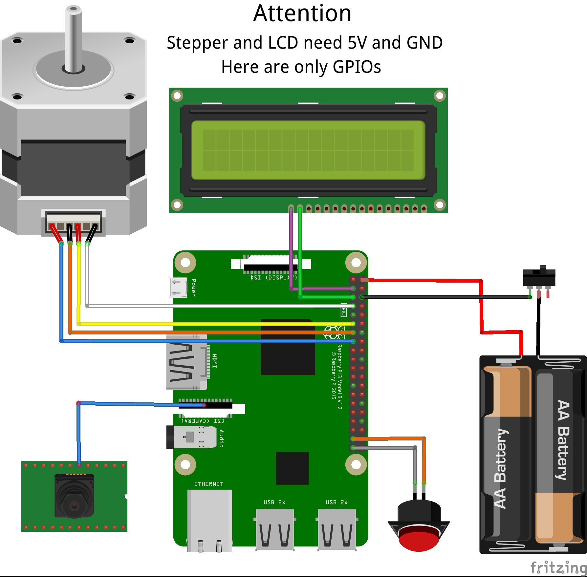
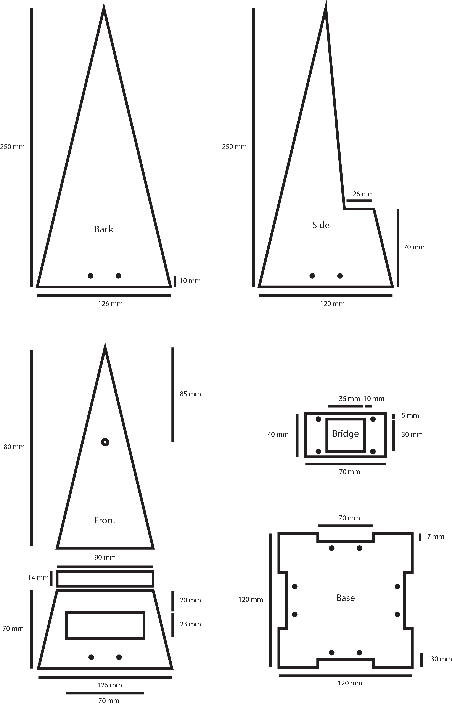
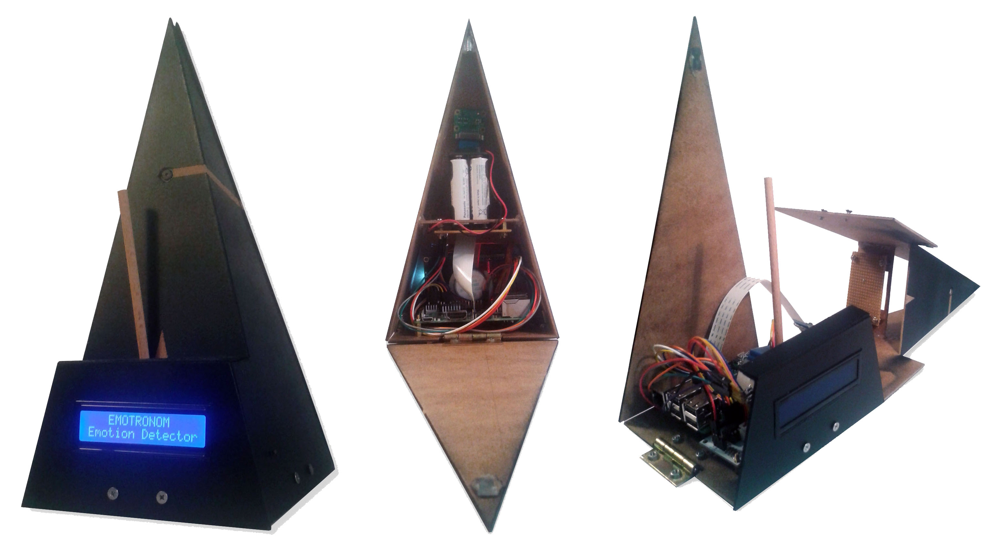

# Emotronom - Emotion Detection

The Emotronom is a Mini-Game-Module to play with your facial expressions. Its software recognizes human faces and their corresponding emotion from camera feed. Powered by OpenCV and Deep Learning deployed on an Raspberry Pi system.

## Deep Learning Model

The model used is from this [research paper](https://github.com/oarriaga/face_classification/blob/master/report.pdf) written by Octavio Arriaga, Paul G. Plöger, and Matias Valdenegro. It is capable to detect seven different emotions and scroed on the FAR-2013 dataset with an accuracy of 66%. Cause of the low amount of parameters the model is suitable for real-time apps and the deployment on limited hardware.

## Hardware and Circuit

The following wiring diagram indicates the used pins on the raspi by the script as well as the employed hardware components. Setup:

* Raspberry Pi 3 B+
* Raspberry Pi Camera V2
* 16x2 character LCD with I2C interface
* 5V DC step motor with driver-board ULN2003
* push button
* slide switch
* 4x AA batteries

Note: Instead of two batteries as displayed, I used 4 batteries. Simply make sure you end up with a voltage around 5V.

## Blueprint

The provided blueprint shows the dimensions for the module. I cutted the parts out of 2 mm thin wood. Afterwards both sides and the upper front part were glued together. Inside goes the bridge on a hight of 80 mm also glued. Last two parts stick together are the bottom front with the small top cover. All parts are connected to the base by a hinge.   

>

## Install

Main Requirements:

* raspbian stretch lite
* python 3.5.3
* tensorflow 1.10.0
* keras 2.2.2
* opencv 3.4.2.16

After installing the main requirements clone this repository onto the raspi and configure an autostart for the script. For me worked to configure the raspi to auto log-in as an user first and then edit /etc/profile to change into the repo directory and run 'python3 emotions.py'.   

## Credit

* Octavio Arriaga, Matias Valdenegro-Toro, Paul Plöger.
Real-time Convolutional Neural Networks for Emotion and Gender Classification [research paper](https://github.com/oarriaga/face_classification/blob/master/report.pdf).
